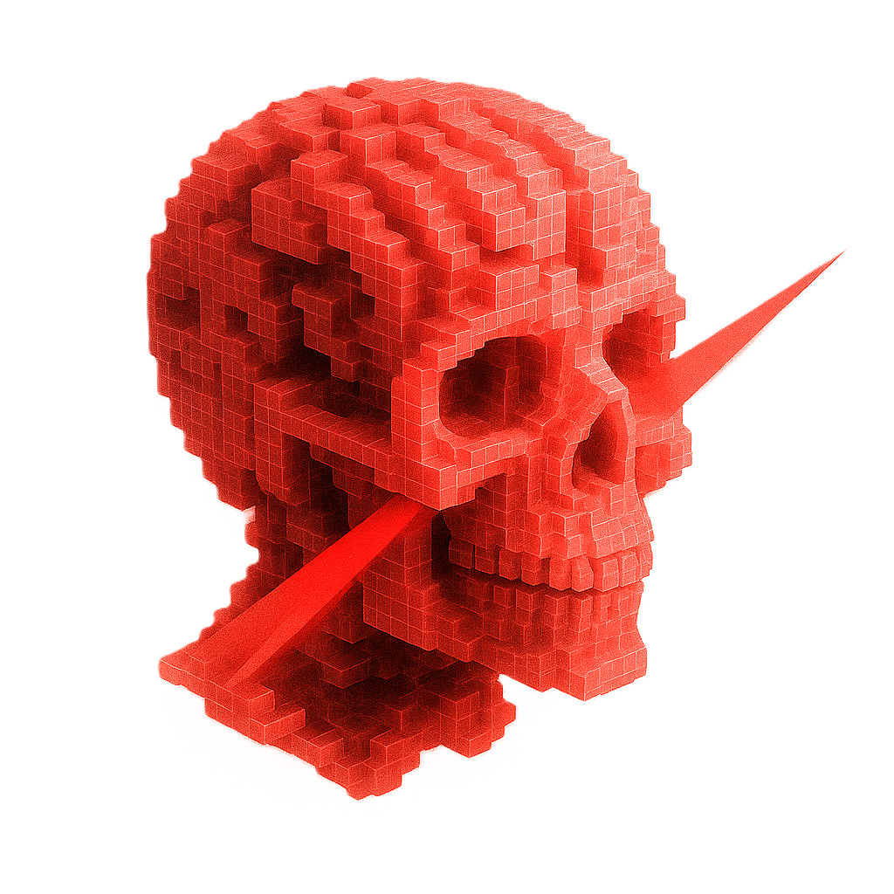

# Visualizador de Volúmenes mediante Trazado de Rayos en Godot

  

## Resumen

Este Trabajo Fin de Grado presenta el desarrollo e implementación de un visualizador de datos volumétricos en tiempo real basado en la técnica de trazado de rayos (*raymarching*), implementado íntegramente en el motor de videojuegos Godot.

La herramienta permite visualizar estructuras internas complejas mediante el muestreo de datos volumétricos 3D y una función de transferencia personalizable en tiempo real. Incluye un pipeline de renderizado completo en tres pasos, carga de volúmenes desde secuencias de imágenes PNG y una interfaz interactiva para controlar los parámetros del volumen visualizado.

## Funcionalidades

- Renderizado volumétrico en tiempo real mediante *raymarching*
- Implementación completa en Godot Engine (v4.x)
- Pipeline de tres pasos:
  - Paso 1 y 2: Captura de posiciones de entrada/salida de rayos
  - Paso 3: Shader de raymarching para el muestreo del volumen
- Carga de volúmenes desde secuencias de imágenes PNG
- Personalización en tiempo real de la función de transferencia
- Ajuste dinámico de parámetros (umbral de densidad, tamaño de paso, etc.)
- Interfaz gráfica para exploración interactiva
- Evaluación de rendimiento y calidad visual

## Ejemplos de renderizado

  

